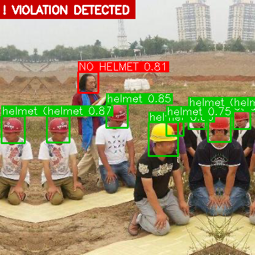

# Детектор СИЗ — каски на стройплощадке


Детектор на базе YOLOv8 для контроля соблюдения требований СИЗ.
Распознаёт **каски** и **непокрытые головы**, фиксирует нарушения — рабочих без защитного шлема.

---

## Результаты

| Класс  | Precision | Recall | mAP50 | mAP50-95 |
|--------|-----------|--------|-------|----------|
| все    | 0.936     | 0.874  | 0.937 | 0.641    |
| helmet | 0.945     | 0.905  | 0.961 | 0.652    |
| head   | 0.926     | 0.843  | 0.913 | 0.630    |

Оценка на отложенной тестовой выборке (500 изображений, 2412 объектов).
Обучение: 50 эпох, YOLOv8s, 640px, RTX 3070 Laptop — ~36 минут.

---

## Датасет

[Hard Hat Workers Dataset](https://www.kaggle.com/datasets/andrewmvd/hard-hat-detection)
— 5000 изображений, аннотации в формате Pascal VOC, два класса: `helmet`, `head`.

Разбивка: 80% train / 10% val / 10% test.

---

## Структура проекта

```
ppe-helmet-detection/
├── data/
│   ├── annotations/        # XML-файлы Pascal VOC
│   ├── images/             # исходные изображения (.png)
│   ├── labels/             # конвертированные метки YOLO (.txt)
│   ├── dataset/            # разбивка train / val / test
│   │   ├── train/
│   │   ├── val/
│   │   └── test/
│   └── dataset.yaml        # конфиг датасета Ultralytics
├── runs/
│   ├── yolov8s_no_person/  # результаты обучения + веса
│   ├── eval_test/          # результаты оценки на test-split
│   └── predict/            # результаты inference + violations.txt
├── src/
│   ├── convert_voc_to_yolo.py
│   ├── split_dataset.py
│   ├── train.py
│   ├── evaluate.py
│   ├── predict.py
│   └── export.py
├── .gitignore
└── README.md
```

---

## Установка

```bash
git clone https://github.com/<your-username>/ppe-helmet-detection.git
cd ppe-helmet-detection

conda create -n ppe python=3.10 -y
conda activate ppe

pip install ultralytics opencv-python
```

---

## Использование

### 1. Подготовка данных

Скачай датасет с Kaggle и разложи файлы:
```
data/images/       -- файлы .png
data/annotations/  -- файлы .xml (Pascal VOC)
```

Конвертируй аннотации в формат YOLO и разбей на выборки:

```bash
python src/convert_voc_to_yolo.py
python src/split_dataset.py
```

Создай `data/dataset.yaml`:

```yaml
path: data/dataset
train: train/images
val:   val/images
test:  test/images

nc: 2
names: ["helmet", "head"]
```

### 2. Обучение

```bash
python src/train.py
```

Веса сохраняются в `runs/yolov8s_no_person/weights/`.

### 3. Оценка на тестовой выборке

```bash
python src/evaluate.py
```

Результаты (матрица ошибок, PR-кривая, F1-кривая) сохраняются в `runs/eval_test/`.

### 4. Inference + детекция нарушений

```bash
# папка с изображениями
python src/predict.py --source data/dataset/test/images

# пониженный порог для лучшего Recall по классу head
python src/predict.py --source data/dataset/test/images --conf 0.20
```

Аннотированные изображения и `violations.txt` сохраняются в `runs/predict/<source_name>/`.

Логика нарушений: если bbox класса `head` не имеет рядом bbox класса `helmet` —
объект помечается как **NO HELMET**, на изображении появляется красный баннер.

### 5. Экспорт в ONNX

```bash
# стандартный FP32
python src/export.py

# FP16 -- меньше размер
python src/export.py --half
```

Результат: `runs/yolov8s_no_person/weights/best.onnx`

---


## Ссылки

- [Ultralytics YOLOv8](https://github.com/ultralytics/ultralytics)
- [Hard Hat Workers Dataset](https://www.kaggle.com/datasets/andrewmvd/hard-hat-detection)
- Jocher, G. et al. (2023). *Ultralytics YOLO* (Version 8.0.0). https://github.com/ultralytics/ultralytics
